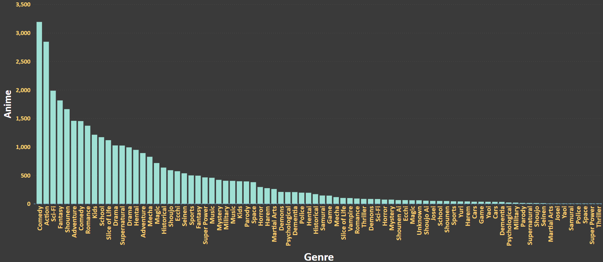

# **Anime Recommendation System using KNN**
### **Kahan Dave**
### **Hussain Bhojani**
</br></br>

## **Introduction**

<div style="text-align: justify">
  <blockquote>There are innumerable titles available in the vast and varied world of anime. Finding the next excellent anime series to watch can be a difficult chore for many anime enthusiasts. Systems that make recommendations are useful in this situation. Using the K-Nearest Neighbor (KNN) algorithm, we created a recommendation system for anime in this project.
  </blocquote>  
</div>
</br></br>

## **Data files that I have utilised**
****

<div>
 <blockquote>
   
[anime.csv](https://www.kaggle.com/datasets/CooperUnion/anime-recommendations-database) :- Contains daily data of greenhouse gases like PM10, PM2.2, O3, SO2, Benzene in ppm from 2015 to 2020. Moreover, it also store the AQI Index and the AQI Bucket affiliated with it. Also, it has data from each major cities from India.2015 to 2020.

 </blockquote>
</div>

</br></br>


## **Files and folders in this repo**
****

<div>
 <blockquote>

**Images** :- Contains all the graphs that were generated during exploratory data analysis.

**Data** :- Contains all the data files that were utilized. These files were either outsourced from the internet or were generated during data pre-processing.

**KH_Final_Project.ipynb** :- Contains all the data pre-processing and exploratory data analysis that took place.

**KH_Final_Project.py** :- Just a executable script for the notebook version.

 </blockquote>
</div>

</br></br>

## **Exploratory Data Analysis**


</br></br>


## **Data Pre-Processing**

<div style="text-align: justify">
  <blockquote>This is the dataset that we worked on.
  </blocquote>  
</div>
</br></br>


<div>

<table border="1" class="dataframe">
  <thead>
    <tr style="text-align: right;">
      <th></th>
      <th>anime_id</th>
      <th>name</th>
      <th>genre</th>
      <th>type</th>
      <th>episodes</th>
      <th>rating</th>
      <th>members</th>
    </tr>
  </thead>
  <tbody>
    <tr>
      <th>0</th>
      <td>32281</td>
      <td>Kimi no Na wa.</td>
      <td>Drama, Romance, School, Supernatural</td>
      <td>Movie</td>
      <td>1</td>
      <td>9.37</td>
      <td>200630</td>
    </tr>
    <tr>
      <th>1</th>
      <td>5114</td>
      <td>Fullmetal Alchemist: Brotherhood</td>
      <td>Action, Adventure, Drama, Fantasy, Magic, Mili...</td>
      <td>TV</td>
      <td>64</td>
      <td>9.26</td>
      <td>793665</td>
    </tr>
    <tr>
      <th>2</th>
      <td>28977</td>
      <td>Gintama°</td>
      <td>Action, Comedy, Historical, Parody, Samurai, S...</td>
      <td>TV</td>
      <td>51</td>
      <td>9.25</td>
      <td>114262</td>
    </tr>
    <tr>
      <th>3</th>
      <td>9253</td>
      <td>Steins;Gate</td>
      <td>Sci-Fi, Thriller</td>
      <td>TV</td>
      <td>24</td>
      <td>9.17</td>
      <td>673572</td>
    </tr>
    <tr>
      <th>4</th>
      <td>9969</td>
      <td>Gintama&amp;#039;</td>
      <td>Action, Comedy, Historical, Parody, Samurai, S...</td>
      <td>TV</td>
      <td>51</td>
      <td>9.16</td>
      <td>151266</td>
    </tr>
    <tr>
      <th>...</th>
      <td>...</td>
      <td>...</td>
      <td>...</td>
      <td>...</td>
      <td>...</td>
      <td>...</td>
      <td>...</td>
    </tr>
    <tr>
      <th>12289</th>
      <td>9316</td>
      <td>Toushindai My Lover: Minami tai Mecha-Minami</td>
      <td>Hentai</td>
      <td>OVA</td>
      <td>1</td>
      <td>4.15</td>
      <td>211</td>
    </tr>
    <tr>
      <th>12290</th>
      <td>5543</td>
      <td>Under World</td>
      <td>Hentai</td>
      <td>OVA</td>
      <td>1</td>
      <td>4.28</td>
      <td>183</td>
    </tr>
    <tr>
      <th>12291</th>
      <td>5621</td>
      <td>Violence Gekiga David no Hoshi</td>
      <td>Hentai</td>
      <td>OVA</td>
      <td>4</td>
      <td>4.88</td>
      <td>219</td>
    </tr>
    <tr>
      <th>12292</th>
      <td>6133</td>
      <td>Violence Gekiga Shin David no Hoshi: Inma Dens...</td>
      <td>Hentai</td>
      <td>OVA</td>
      <td>1</td>
      <td>4.98</td>
      <td>175</td>
    </tr>
    <tr>
      <th>12293</th>
      <td>26081</td>
      <td>Yasuji no Pornorama: Yacchimae!!</td>
      <td>Hentai</td>
      <td>Movie</td>
      <td>1</td>
      <td>5.46</td>
      <td>142</td>
    </tr>
  </tbody>
</table>
<p>12294 rows × 7 columns</p>
</div>

<div style="text-align: justify">
  <blockquote>There were missing values in the genre and type columns, which I replaced with "Unknown" since the information was not available. However, in the episode column, there were values marked as 'Unknown', which I converted to NaN as the episode column had numerical values. Those NaN values was replced by the median as there were really few episode rows that were null.
</blocquote>  
</div>
</br></br>
    


```python
def fill_null_with_genre_mode(df, column_name, group_by_column_name):
    groupby = df.groupby(group_by_column_name)[column_name]
    df[column_name] = groupby.apply(lambda x: x.fillna(method='ffill'))
    return df
```

<div style="text-align: justify">
  <blockquote>Based on the mode of the values in the same column for each group defined by another column, above Python function fills null values in a given column of a pandas DataFrame.
</blocquote>  
</div>
</br></br>


```python
anime = fill_null_with_genre_mode(anime, 'rating', 'genre')
```
<div style="text-align: justify">
  <blockquote>This means that the null values in the 'rating' column are filled with the mode rating value for each genre included in the 'genre' column of the anime DataFrame. This is done to make sure the 'rating' column contains non-null values and to provide the data in the DataFrame a more accurate representation.
</blocquote>  
</div>
</br></br>


<div style="text-align: justify">
  <blockquote>The categorical variables "genre" and "type" were converted into numerical values using one hot encoding. Then, a new dataframe was created by combining these encoded variables with the selected columns "rating", "members", and "episodes".
</blocquote>  
</div>
</br></br>

<div>

<table border="1" class="dataframe">
  <thead>
    <tr style="text-align: right;">
      <th></th>
      <th>Adventure</th>
      <th>Cars</th>
      <th>Comedy</th>
      <th>Dementia</th>
      <th>Demons</th>
      <th>Drama</th>
      <th>Ecchi</th>
      <th>Fantasy</th>
      <th>Game</th>
      <th>Harem</th>
      <th>...</th>
      <th>Movie</th>
      <th>Music</th>
      <th>ONA</th>
      <th>OVA</th>
      <th>Special</th>
      <th>TV</th>
      <th>Unknown</th>
      <th>rating</th>
      <th>members</th>
      <th>episodes</th>
    </tr>
  </thead>
  <tbody>
    <tr>
      <th>0</th>
      <td>0</td>
      <td>0</td>
      <td>0</td>
      <td>0</td>
      <td>0</td>
      <td>0</td>
      <td>0</td>
      <td>0</td>
      <td>0</td>
      <td>0</td>
      <td>...</td>
      <td>1</td>
      <td>0</td>
      <td>0</td>
      <td>0</td>
      <td>0</td>
      <td>0</td>
      <td>0</td>
      <td>9.37</td>
      <td>200630</td>
      <td>1</td>
    </tr>
    <tr>
      <th>1</th>
      <td>1</td>
      <td>0</td>
      <td>0</td>
      <td>0</td>
      <td>0</td>
      <td>1</td>
      <td>0</td>
      <td>1</td>
      <td>0</td>
      <td>0</td>
      <td>...</td>
      <td>0</td>
      <td>0</td>
      <td>0</td>
      <td>0</td>
      <td>0</td>
      <td>1</td>
      <td>0</td>
      <td>9.26</td>
      <td>793665</td>
      <td>64</td>
    </tr>
    <tr>
      <th>2</th>
      <td>0</td>
      <td>0</td>
      <td>1</td>
      <td>0</td>
      <td>0</td>
      <td>0</td>
      <td>0</td>
      <td>0</td>
      <td>0</td>
      <td>0</td>
      <td>...</td>
      <td>0</td>
      <td>0</td>
      <td>0</td>
      <td>0</td>
      <td>0</td>
      <td>1</td>
      <td>0</td>
      <td>9.25</td>
      <td>114262</td>
      <td>51</td>
    </tr>
    <tr>
      <th>3</th>
      <td>0</td>
      <td>0</td>
      <td>0</td>
      <td>0</td>
      <td>0</td>
      <td>0</td>
      <td>0</td>
      <td>0</td>
      <td>0</td>
      <td>0</td>
      <td>...</td>
      <td>0</td>
      <td>0</td>
      <td>0</td>
      <td>0</td>
      <td>0</td>
      <td>1</td>
      <td>0</td>
      <td>9.17</td>
      <td>673572</td>
      <td>24</td>
    </tr>
    <tr>
      <th>4</th>
      <td>0</td>
      <td>0</td>
      <td>1</td>
      <td>0</td>
      <td>0</td>
      <td>0</td>
      <td>0</td>
      <td>0</td>
      <td>0</td>
      <td>0</td>
      <td>...</td>
      <td>0</td>
      <td>0</td>
      <td>0</td>
      <td>0</td>
      <td>0</td>
      <td>1</td>
      <td>0</td>
      <td>9.16</td>
      <td>151266</td>
      <td>51</td>
    </tr>
    <tr>
      <th>...</th>
      <td>...</td>
      <td>...</td>
      <td>...</td>
      <td>...</td>
      <td>...</td>
      <td>...</td>
      <td>...</td>
      <td>...</td>
      <td>...</td>
      <td>...</td>
      <td>...</td>
      <td>...</td>
      <td>...</td>
      <td>...</td>
      <td>...</td>
      <td>...</td>
      <td>...</td>
      <td>...</td>
      <td>...</td>
      <td>...</td>
      <td>...</td>
    </tr>
    <tr>
      <th>12289</th>
      <td>0</td>
      <td>0</td>
      <td>0</td>
      <td>0</td>
      <td>0</td>
      <td>0</td>
      <td>0</td>
      <td>0</td>
      <td>0</td>
      <td>0</td>
      <td>...</td>
      <td>0</td>
      <td>0</td>
      <td>0</td>
      <td>1</td>
      <td>0</td>
      <td>0</td>
      <td>0</td>
      <td>4.15</td>
      <td>211</td>
      <td>1</td>
    </tr>
    <tr>
      <th>12290</th>
      <td>0</td>
      <td>0</td>
      <td>0</td>
      <td>0</td>
      <td>0</td>
      <td>0</td>
      <td>0</td>
      <td>0</td>
      <td>0</td>
      <td>0</td>
      <td>...</td>
      <td>0</td>
      <td>0</td>
      <td>0</td>
      <td>1</td>
      <td>0</td>
      <td>0</td>
      <td>0</td>
      <td>4.28</td>
      <td>183</td>
      <td>1</td>
    </tr>
    <tr>
      <th>12291</th>
      <td>0</td>
      <td>0</td>
      <td>0</td>
      <td>0</td>
      <td>0</td>
      <td>0</td>
      <td>0</td>
      <td>0</td>
      <td>0</td>
      <td>0</td>
      <td>...</td>
      <td>0</td>
      <td>0</td>
      <td>0</td>
      <td>1</td>
      <td>0</td>
      <td>0</td>
      <td>0</td>
      <td>4.88</td>
      <td>219</td>
      <td>4</td>
    </tr>
    <tr>
      <th>12292</th>
      <td>0</td>
      <td>0</td>
      <td>0</td>
      <td>0</td>
      <td>0</td>
      <td>0</td>
      <td>0</td>
      <td>0</td>
      <td>0</td>
      <td>0</td>
      <td>...</td>
      <td>0</td>
      <td>0</td>
      <td>0</td>
      <td>1</td>
      <td>0</td>
      <td>0</td>
      <td>0</td>
      <td>4.98</td>
      <td>175</td>
      <td>1</td>
    </tr>
    <tr>
      <th>12293</th>
      <td>0</td>
      <td>0</td>
      <td>0</td>
      <td>0</td>
      <td>0</td>
      <td>0</td>
      <td>0</td>
      <td>0</td>
      <td>0</td>
      <td>0</td>
      <td>...</td>
      <td>1</td>
      <td>0</td>
      <td>0</td>
      <td>0</td>
      <td>0</td>
      <td>0</td>
      <td>0</td>
      <td>5.46</td>
      <td>142</td>
      <td>1</td>
    </tr>
  </tbody>
</table>
<p>12294 rows × 93 columns</p>
</div>
</br></br>

## **K-Nearest Neighbor**

<div style="text-align: justify">
  <blockquote>Based on their attributes, and to identify each anime's nearest neighbors in a dataset KNN was used. To ensure that all the characteristics have a comparable range of values, the algorithm first scales or normalizes the data. Then, it uses a machine learning technique called k-nearest neighbors to identify each anime's six closest neighbors within the dataset. This approach effectively finds the closest neighbors by using a mathematical method known as ball tree. The code then determines the distances and indices of the algorithm's closest neighbors. The dataset can be subjected to numerous analyses using this method, including the creation of suggestions.</br></br>

  The average silhouette_score of the above model is -0.016 
</blocquote>  
</div>
</br></br>
    
    


```python
def anime_recommendation(anime_name, anime_data, anime_features):
    # Scale the features
    scaled_data = StandardScaler()
    anime_features_scaled = scaled_data.fit_transform(anime_features)

    # Fit the NearestNeighbors model
    nbrs = NearestNeighbors(n_neighbors=6, algorithm='ball_tree').fit(anime_features_scaled)
    
    # Find the distances and indices of the nearest neighbors
    distances, indices = nbrs.kneighbors(anime_features_scaled)

    # Find the index of the input anime in the anime_data DataFrame
    anime_index = anime_data[anime_data['name'] == anime_name].index[0]

    # Get the indices of the 5 closest anime (excluding the input anime)
    top_5_indices = indices[anime_index][1:]

    # Return the top 5 recommended anime names
    return anime_data.iloc[top_5_indices]['name'].values
```

<div style="text-align: justify">
  <blockquote>The above function accepts an anime's name and a few details. To locate other anime that are comparable to the input anime, the system employs a machine learning approach called NearestNeighbors.</br></br>

  To ensure that the input anime's features are comparable to those of the other anime, they are first scaled (standardized). The NearestNeighbors model is then trained using scaled features from every anime.</br></br>

  The system then compares all of the anime's features to the input anime's features to determine which anime is the most similar to it. The top 5 anime with the shortest distances—those that are the most comparable—are then returned after sorting these distances.</br></br>

  The system's final recommendation is the names of these top 5 anime.
</blocquote>  
</div>
</br></br>


## **Results**


```python
anime_name = "Fairy Tail"
recommended_anime = anime_recommendation(anime_name, anime, anime_features)
print(recommended_anime)
```

    'Soul Eater' 'Fairy Tail 2014 ' 'Magi The Labyrinth of Magic' 'D Gray man' 'Akame ga Kill '
    


```python
anime_name = "Bleach"
recommended_anime = anime_recommendation(anime_name, anime, anime_features)
print(recommended_anime)
```

    'Katekyo Hitman Reborn ' 'Naruto' 'Hunter x Hunter 2011 ' 'Kill la Kill' 'Soul Eater'


```python
anime_name = "Noragami"
recommended_anime = anime_recommendation(anime_name, anime, anime_features)
print(recommended_anime)
```

    'Noragami Aragoto' 'Soul Eater' 'Akame ga Kill ' 'Fate Zero' 'D Gray man'
    

## **Conclusion**

<div style="text-align: justify">
  <blockquote>In conclusion, even if the KNN model's recommendations have shown to be highly successful, the average silhouette score of -0.016 may not be very high. This shows that while the silhouette score can offer information about how well the calculations was done, it is not the only factor affecting how well the model performs at producing useful recommendations. Despite the relatively low silhouette score, the KNN algorithm has been successful in locating patterns within the dataset and effectively grouping related anime. This emphasizes how crucial it is to take into account a variety of evaluation metrics as well as actual outcomes when evaluating the effectiveness of a recommendation model, as occasionally a low score on one parameter may not necessarily reflect bad performance.
</blocquote>  
</div>
</br></br>
